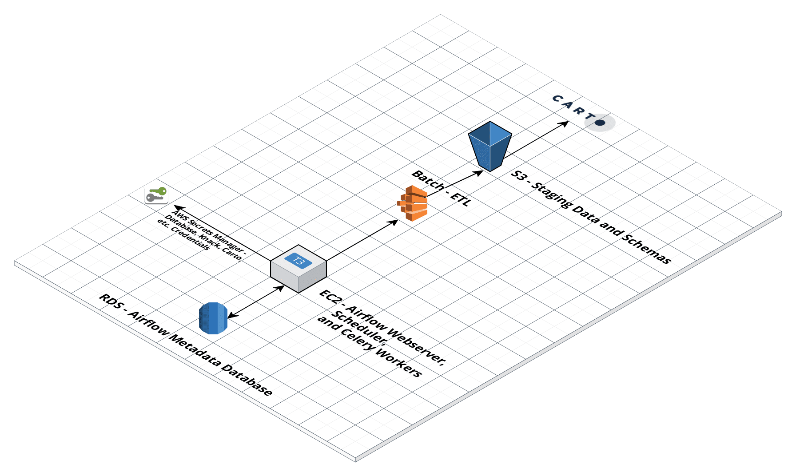

[](https://travis-ci.com/CityOfPhiladelphia/databridge-airflow)

# databridge-airflow
Airflow instance for ETL's involving Databridge

## Goal
- Load data from the Oracle SDE version of DataBridge into the new Postgres DataBridge (DataBridge2).
- Geo-enrich data in DataBridge2
- Provide data quality checks to ensure empty tables or tables with missing data are not pushed to production
- Load data into Carto DB

## Overview
- Jobs are scheduled and triggered by Airflow
- Jobs consist of data extraction, transformation, and loading - primarily through using [databridge-etl-tools](https://github.com/CityOfPhiladelphia/databridge-etl-tools) and [extract-knack](https://github.com/CityOfPhiladelphia/extract-knack) in AWS Batch and Lambda.
- Jobs are pushed to a RabbitMQ task queue by Airflow
- Airflow stores encrypted database credentials and other metadata in a Postgres database
- All secrets (database credentials, slack API keys, carto API keys) are stored in AWS Secrets Manager. These are fetched from AWS Secrets Manager when Airflow is launched.



## Requirements
- docker-compose
- Docker
- Access to AWS S3, Batch, and AWS Secrets Manager

## Configuration
- Create an EC2 instance from our `airflow` AMI with access to S3, Batch, and AWS Secrets Manager
- To set all of the database connections up, simply pass the SEED_DB environment variable to docker-compose. Airflow's entrypoint will pick up this environment variable, fetch all database secrets from AWS Secrets Manager, and load them into Airflow's local Postgres Database: 
```bash
# Launch the server and seed the database (initial deployment)
SEED_DB=true docker-compose -f docker-compose.dev.yml up

## Launch the server without seeding the database (redeployment)
docker-compose -f docker-compose.dev.yml up
```

## Deployment
- Automated deployment is done by Travis CI and AWS Code Deploy. Anytime a commit is made to the master branch, a Travis CI job runs which tests airflow and redeploys it to a production EC2 instance. For this reason, make sure any development takes place on a branch and is thoroughly QA'd before merging to master. Notifications as to the status of the deployment are posted to #airflow-prod.

- If you're launching a production environment for the first time, pass the SEED_DB environment variable to seed the RDS database:
```bash
SEED_DB=true docker-compose -f docker-compose.prod.yml up -d
```

## Testing
```bash
source scripts/run_tests.sh
```